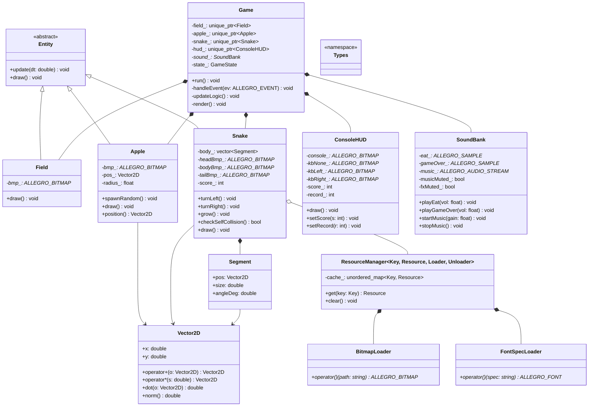

# 🐍 Snake Game

**Um Snake Game moderno e altamente customizável escrito em C++17 com Allegro 5**

## ✨ Características

**Jogabilidade Avançada**
- Movimento suave com wrapping de tela
- Sistema de crescimento progressivo
- Colisões precisas e responsivas
- Múltiplos esquemas de cores

**Graphics & UI**
- Renderização otimizada com Allegro 5
- HUD profissional com score em tempo real
- Animções suaves e efeitos visuais
- Suporte a sprites customizados

**Sistema de Áudio**
- Música de fundo dinâmica
- Efeitos sonoros imersivos
- Controles independentes de volume
- Sistema de mute seletivo

 **Arquitetura Profissional**
- Código modular e bem documentado
- Sistema de build CMake moderno
- Gerenciamento automático de recursos

## Estrutura do Projeto

### Componentes Principais
- Game: Loop principal e gerenciamento de estado
- Snake: Lógica da cobra e movimento
- Apple: Sistema de comida
- Field: Campo de jogo
- ConsoleHUD: Interface do usuário
- SoundBank: Sistema de áudio

##  Começando

### Pré-requisitos

- **CMake 3.16+**
- **Compilador C++17** (GCC, Clang, MSVC)
- **Allegro 5.2+**

#### Windows (MSYS2)
```bash
pacman -S --needed mingw-w64-x86_64-{gcc,cmake,allegro,pkg-config}
```
#### MacOS 
```bash
brew install allegro cmake pkg-config
```
#### Ubuntu

```bash
sudo apt install build-essential cmake liballegro5-dev pkg-config
```
##  Como rodar

Em SnakeGame/build:

```bash
# Recompile
cd build
cmake ..
make -j4

# Teste NO TERMINAL DO WS (fora do Docker)
./bin/SnakeText
./bin/SnakeGame 
./bin/SnakeGameNoAudio #Versão criada apenas para implementar no Docker 
```

## 🎮 Como Jogar
- Virar Esquerda	← ou A
- Virar Direita	→ ou D
- Pausar	P
- Mudar Cor	C
- Mute Música	M
- Mute Efeitos	N
- Sair	ESC

## ✨ Diagramas

###  Diagrama de Hierarquia de Classes



###  Fluxo de Dados

```mermaid
flowchart TD
    %% ====== INITIALIZATION ======
    START[Program Start] --> INIT[Initialize Systems]
    INIT --> ALLEGRO_INIT[Allegro Initialization]
    INIT --> RESOURCE_LOAD[Load Resources]
    INIT --> AUDIO_INIT[Audio Initialization]
    
    %% ====== MAIN LOOP ======
    INIT --> MAIN_LOOP[Main Game Loop]
    
    MAIN_LOOP --> EVENT_PROCESS[Process Events]
    EVENT_PROCESS --> KEY_INPUT[Keyboard Input]
    EVENT_PROCESS --> WINDOW_EVENTS[Window Events]
    
    MAIN_LOOP --> UPDATE_LOGIC[Update Game Logic]
    UPDATE_LOGIC --> SNAKE_UPDATE[Update Snake]
    UPDATE_LOGIC --> COLLISION_CHECK[Check Collisions]
    UPDATE_LOGIC --> APPLE_CHECK[Check Apple Collection]
    UPDATE_LOGIC --> SCORE_UPDATE[Update Score]
    
    MAIN_LOOP --> RENDER_FRAME[Render Frame]
    RENDER_FRAME --> RENDER_FIELD[Render Field]
    RENDER_FRAME --> RENDER_ENTITIES[Render Entities]
    RENDER_FRAME --> RENDER_HUD[Render HUD]
    RENDER_FRAME --> RENDER_OVERLAYS[Render Overlays]
    
    %% ====== INPUT PROCESSING ======
    KEY_INPUT --> LEFT_RIGHT[Left/Right Keys]
    KEY_INPUT --> SPECIAL_KEYS[Special Keys]
    
    LEFT_RIGHT --> SNAKE_ROTATION[Snake Rotation]
    SPECIAL_KEYS --> PAUSE[Pause Game]
    SPECIAL_KEYS --> COLOR_CHANGE[Change Colors]
    SPECIAL_KEYS --> MUTE_TOGGLE[Toggle Mute]
    
    %% ====== GAME LOGIC ======
    SNAKE_UPDATE --> MOVE_SNAKE[Move Snake]
    MOVE_SNAKE --> WRAP_BORDERS[Wrap Borders]
    MOVE_SNAKE --> UPDATE_SEGMENTS[Update Segments]
    
    COLLISION_CHECK --> SELF_COLLISION[Self-Collision]
    COLLISION_CHECK --> BORDER_COLLISION[Border Collision]
    
    APPLE_CHECK --> COLLISION_DETECT[Collision Detection]
    COLLISION_DETECT --> EAT_APPLE[Eat Apple]
    EAT_APPLE --> PLAY_SOUND[Play Eat Sound]
    EAT_APPLE --> GROW_SNAKE[Grow Snake]
    EAT_APPLE --> SPAWN_APPLE[Spawn New Apple]
    
    %% ====== STATE MANAGEMENT ======
    SELF_COLLISION --> GAME_OVER[Game Over]
    BORDER_COLLISION --> GAME_OVER
    
    GAME_OVER --> STOP_MUSIC[Stop Music]
    GAME_OVER --> PLAY_GAMEOVER_SFX[Play GameOver Sound]
    GAME_OVER --> SHOW_GAMEOVER[Show GameOver Screen]
    
    %% ====== RENDERING PIPELINE ======
    RENDER_FIELD --> DRAW_BACKGROUND[Draw Background]
    RENDER_FIELD --> DRAW_BORDERS[Draw Borders]
    
    RENDER_ENTITIES --> DRAW_SNAKE[Draw Snake]
    RENDER_ENTITIES --> DRAW_APPLE[Draw Apple]
    
    DRAW_SNAKE --> APPLY_COLORS[Apply Color Preset]
    DRAW_SNAKE --> DRAW_SEGMENTS[Draw Segments]
    DRAW_SNAKE --> DRAW_EYES[Draw Eyes]
    
    RENDER_HUD --> DRAW_SCORE[Draw Score]
    RENDER_HUD --> DRAW_RECORD[Draw Record]
    RENDER_HUD --> DRAW_KEYBOARD[Draw Keyboard]
    RENDER_HUD --> DRAW_INSTRUCTIONS[Draw Instructions]
    
    RENDER_OVERLAYS --> MENU_OVERLAY[Menu Overlay]
    RENDER_OVERLAYS --> GAMEOVER_OVERLAY[GameOver Overlay]
    
    %% ====== STYLING ======
    classDef init fill:#e3f2fd,stroke:#1565c0
    classDef input fill:#f3e5f5,stroke:#7b1fa2
    classDef logic fill:#e8f5e8,stroke:#2e7d32
    classDef render fill:#fff3e0,stroke:#ef6c00
    classDef audio fill:#ffebee,stroke:#c62828
    
    class START,INIT,ALLEGRO_INIT,RESOURCE_LOAD,AUDIO_INIT init
    class EVENT_PROCESS,KEY_INPUT,WINDOW_EVENTS,LEFT_RIGHT,SPECIAL_KEYS,SNAKE_ROTATION,PAUSE,COLOR_CHANGE,MUTE_TOGGLE input
    class UPDATE_LOGIC,SNAKE_UPDATE,COLLISION_CHECK,APPLE_CHECK,SCORE_UPDATE,MOVE_SNAKE,WRAP_BORDERS,UPDATE_SEGMENTS,SELF_COLLISION,BORDER_COLLISION,COLLISION_DETECT,EAT_APPLE,GROW_SNAKE,SPAWN_APPLE,GAME_OVER logic
    class RENDER_FRAME,RENDER_FIELD,RENDER_ENTITIES,RENDER_HUD,RENDER_OVERLAYS,DRAW_BACKGROUND,DRAW_BORDERS,DRAW_SNAKE,DRAW_APPLE,APPLY_COLORS,DRAW_SEGMENTS,DRAW_EYES,DRAW_SCORE,DRAW_RECORD,DRAW_KEYBOARD,DRAW_INSTRUCTIONS,MENU_OVERLAY,GAMEOVER_OVERLAY render
    class PLAY_SOUND,STOP_MUSIC,PLAY_GAMEOVER_SFX audio
```



###  Arquitetura Completa do Projeto

```mermaid

graph TB
    %% ====== ENTRY POINT ======
    MAIN[main.cpp] --> GAME[Game]
    
    %% ====== CORE GAME LOOP ======
    GAME --> GAMELOOP[Game Loop]
    GAME --> EVENTMGMT[Event Management]
    GAME --> STATEMGMT[State Management]
    
    %% ====== ENTITY SYSTEM ======
    GAME --> ENTITY[Entity]
    ENTITY --> FIELD[Field]
    ENTITY --> SNAKE[Snake]
    ENTITY --> APPLE[Apple]
    
    %% ====== SNAKE COMPONENTS ======
    SNAKE --> SEGMENT[Segment]
    SNAKE --> MOVEMENT[Movement System]
    SNAKE --> COLLISION[Collision Detection]
    SNAKE --> GROWTH[Growth System]
    
    MOVEMENT --> WRAPPING[Screen Wrapping]
    MOVEMENT --> ROTATION[Rotation Control]
    COLLISION --> SELFCOLL[Self-Collision]
    COLLISION --> APPLE_COLL[Apple Collection]
    
    %% ====== RENDERING SYSTEM ======
    GAME --> RENDER[Renderer]
    RENDER --> GFX[AllegroGfx]
    RENDER --> PRIMITIVES[Primitives]
    RENDER --> BITMAPS[Bitmap Rendering]
    
    FIELD --> FIELD_RENDER[Field Rendering]
    SNAKE --> SNAKE_RENDER[Snake Rendering]
    APPLE --> APPLE_RENDER[Apple Rendering]
    
    %% ====== UI SYSTEM ======
    GAME --> HUD[ConsoleHUD]
    HUD --> SCORE_DISPLAY[Score Display]
    HUD --> KEYBOARD_VIS[Keyboard Visual]
    HUD --> TITLE_DISPLAY[Title Display]
    
    %% ====== AUDIO SYSTEM ======
    GAME --> SOUND[SoundBank]
    SOUND --> MUSIC[Music System]
    SOUND --> SFX[Sound Effects]
    SOUND --> MUTE[Mute Controls]
    
    MUSIC --> MUSIC_STREAM[Audio Stream]
    SFX --> EAT_SFX[Eat Sound]
    SFX --> GAMEOVER_SFX[GameOver Sound]
    
    %% ====== RESOURCE MANAGEMENT ======
    GAME --> RESMGR[ResourceManager]
    RESMGR --> BITMAP_MGR[Bitmap Manager]
    RESMGR --> FONT_MGR[Font Manager]
    
    BITMAP_MGR --> BITMAP_LOADER[BitmapLoader]
    BITMAP_MGR --> BITMAP_UNLOADER[BitmapUnloader]
    FONT_MGR --> FONT_LOADER[FontSpecLoader]
    FONT_MGR --> FONT_UNLOADER[FontUnloader]
    
    %% ====== UTILITIES ======
    GAME --> TYPES[Types]
    TYPES --> CONFIG[Configuration]
    TYPES --> COLOR_PRESETS[Color Presets]
    
    GAME --> VECTOR2D[Vector2D]
    VECTOR2D --> MATH_OPS[Math Operations]
    
    %% ====== DEPENDENCIES ======
    GFX --> ALLEGRO[Allegro 5]
    PRIMITIVES --> ALLEGRO_PRIM[Allegro Primitives]
    BITMAPS --> ALLEGRO_IMG[Allegro Image]
    FONT_MGR --> ALLEGRO_FONT[Allegro Font]
    SOUND --> ALLEGRO_AUDIO[Allegro Audio]
    
    %% ====== DATA FLOW ======
    EVENTMGMT --> KEYBOARD[Keyboard Input]
    KEYBOARD --> SNAKE_CONTROL[Snake Control]
    
    STATEMGMT --> MENU_STATE[Menu State]
    STATEMGMT --> PLAYING_STATE[Playing State]
    STATEMGMT --> GAMEOVER_STATE[GameOver State]
    
    SCORE_DISPLAY --> SCORE_DATA[Score Data]
    KEYBOARD_VIS --> INPUT_STATE[Input State]
    
    %% ====== STYLING ======
    classDef core fill:#e1f5fe,stroke:#01579b,stroke-width:2px
    classDef entity fill:#f3e5f5,stroke:#4a148c,stroke-width:2px
    classDef render fill:#e8f5e8,stroke:#1b5e20,stroke-width:2px
    classDef audio fill:#fff3e0,stroke:#e65100,stroke-width:2px
    classDef ui fill:#fce4ec,stroke:#880e4f,stroke-width:2px
    classDef resource fill:#e0f2f1,stroke:#004d40,stroke-width:2px
    classDef util fill:#fafafa,stroke:#424242,stroke-width:2px
    
    class MAIN,GAME,GAMELOOP,EVENTMGMT,STATEMGMT core
    class ENTITY,SNAKE,APPLE,FIELD,SEGMENT entity
    class RENDER,GFX,PRIMITIVES,BITMAPS,FIELD_RENDER,SNAKE_RENDER,APPLE_RENDER render
    class SOUND,MUSIC,SFX,MUSIC_STREAM,EAT_SFX,GAMEOVER_SFX,MUTE audio
    class HUD,SCORE_DISPLAY,KEYBOARD_VIS,TITLE_DISPLAY,SCORE_DATA,INPUT_STATE ui
    class RESMGR,BITMAP_MGR,FONT_MGR,BITMAP_LOADER,BITMAP_UNLOADER,FONT_LOADER,FONT_UNLOADER resource
    class TYPES,VECTOR2D,CONFIG,COLOR_PRESETS,MATH_OPS util
```

